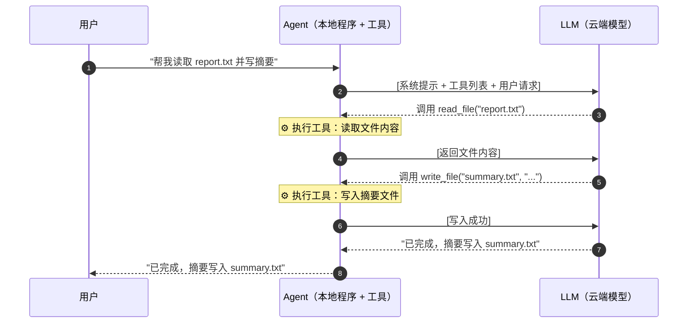
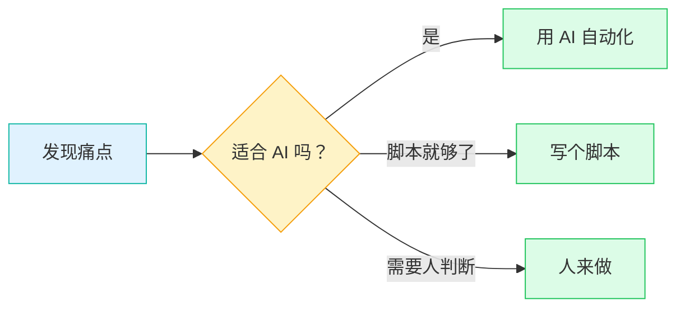

# 从 LLM 底层原理到 Agent 时代

基础篇

  2026

---
layout: new-section
---

# Part 1: LLM

大语言模型是怎么工作的

---

# 模型能力在飞速进化

AI 能独立完成的任务时长 —— **Log 坐标**下是一条直线

  
  

    横轴：模型发布时间 · 纵轴：任务时长（<strong>对数刻度</strong>）
  

<strong>图表直译</strong> 
"不同 LLM 能以 <strong>50% 成功率</strong> 完成的软件任务时长"

<strong>Log 轴上的直线 = 指数增长</strong> 
每格是前一格的 <strong>10 倍</strong>，数据点大致落在一条直线上

<strong>METR 的发现</strong> 
Task Horizon 大约每 <strong>~7 个月翻一倍</strong> —— 持续了多年的稳定节奏

Source: <a href="https://metr.org/time-horizons/" class="underline">METR</a>

<SlideRefs :refs="[
  { label: 'Task-Completion Time Horizons of Frontier AI Models — METR', url: 'https://metr.org/time-horizons/' }
]" />

---

# 换成 Linear 坐标看看

同样的数据 —— 早期任务被压得几乎看不见，近两年是 **Hockey-Stick**

  
  

    横轴：模型发布时间 · 纵轴：任务时长（线性）
  

<strong>早期几乎贴地</strong> 
GPT-2/3 那些"几秒级"任务，在线性尺度下与 0 几乎无区别

<strong>近两年突然起飞</strong> 
前沿模型已经能独立跑 <strong>数小时</strong> 的复杂工程任务

<strong>外推的含义</strong> 
如果指数趋势继续，几年后模型将能独立完成 <strong>数天</strong> 量级的任务

Source: <a href="https://metr.org/time-horizons/" class="underline">METR</a>

---

# 希望大家理解

<v-clicks>

**1.** Token 到底是什么？

**2.** Transformer 的基本结构和原理是什么？

**3.** 为什么大模型本质上是基于统计学的，而且总是带有随机性？

**4.** 为什么大模型会有 Context（上下文）的长度限制？

</v-clicks>

---

# GPT：名字里藏着核心机制

**G**enerative **P**re-trained **T**ransformer

### Generative

**生成式**

不像搜索引擎返回现成网页，而是一个词、一个词"吐"出来

### Pre-trained

**预训练的**

"知识权重"提前在海量数据上训练好。我们日常使用（推理）时，它并不学习新东西，只是在调用已有的权重

### Transformer

**网络结构名称**

它的网络结构名称，也是模型内部最核心的"黑盒"

---

# 推理流程

文本进去，文本出来 —— 中间发生了什么？

  <InferencePipeline />

  

    <carbon-return class="inline text-gray-500" /> 新 Token 加入输入序列，回到开头继续生成 —— 自回归（Autoregressive）
  

---

# 自回归：一个个 Token 蹦出来

像打字机一样 —— 每次只预测下一个

  
Input（已有的 Context）

  

    许多年之后，面对行刑队，奥雷｜ 从这里继续生成
  

  
Output（每次只预测一个 Token）

  <TokenTypewriter :tokens="['良','诺','·','布','恩','地','亚','上','校','将','会','回','想','起','，','他','父','亲','带','他','去','见','识']" :step="0.45" />

《百年孤独》开篇 —— 模型"回想起"了整本书

---

# 何为 Token：数草莓问题

"Strawberry 里有几个 r？" —— 以前的 AI 经常答错

  

    
str

    
aw

    
berry

  

  
模型看到的不是 s-t-r-a-w-b-e-r-r-y 这 10 个字母 —— 而是 <strong>3 个 Token</strong>

  
  
OpenAI Tokenizer：strawberry 被切成 3 段

LLM 不是按字符处理文本 —— 字符级计数不是它的强项

<SlideRefs :refs="[
  { label: 'OpenAI Tokenizer', url: 'https://platform.openai.com/tokenizer' }
]" />

---

# Token → Vector：模型眼中的句子

更完整的例子 —— 一句话在模型眼里是什么样？

  

    
    
① 原始文本

  

  

所有 Token 进入模型前都会被转成 <strong>向量（Vector）</strong> —— 一长串数字，之后全是数学运算。按 Token 计费的"Token"，就是这里切出来的这些块。 想亲眼看分词：<code>platform.openai.com/tokenizer</code>

  

  

    
    
② 切分成 Token（彩色块）

  

  

    
    
③ 每个 Token 对应一个整数 ID

  

---

# Attention Is All You Need

Transformer 内部最重要的机制：**Self-Attention（自注意力）** —— 最早为机器翻译而生，解决 RNN 的"视野"问题

  
  
2017 年 Transformer 原始架构

  

    小明
    去了
    公园
    ，
    后来
    他
    又
    回家了
  

  
"他" 跨越多个 Token 回看到"小明" —— 全局视野

<v-clicks>

- 不预设"只有附近重要" —— 任意两位置都可能相关
- 相关性由 **内容决定**，动态分配权重
- 本质：**一个内容驱动的全局软检索系统**

</v-clicks>

---

# QKV：Attention 怎么算

让大家对"注意力计算有多贵"有个感受 —— 复杂度是 <strong>O(N²)</strong>

$$\text{Attention}(Q, K, V) = \text{softmax}\!\left(\frac{QK^\top}{\sqrt{d_k}}\right) V$$

每个 Token 生成三组向量：Query · Key · Value —— N 个 Token 要两两算相关性，共 <strong>N × N</strong> 次点乘

  
  
"A robot must obey the orders given <strong>it</strong> by human beings..." "it" 该看向谁？—— 由 Q 和 K 的匹配度决定

<strong>图书馆的类比</strong>： 
Q = 你要查什么（便利贴上的主题） 
K = 文件夹的标签 
V = 文件夹里的内容 
匹配 Q 和 K → 按匹配度加权混合对应的 V

顺便：模型并不理解因果，它在计算条件概率 $P(y|x)$

<SlideRefs :refs="[
  { label: 'The Illustrated Transformer — Jay Alammar', url: 'https://jalammar.github.io/illustrated-transformer/' }
]" />

---

# The Bitter Lesson

把人类经验写死进系统，往往打不过 <strong>通用算力 + 全局搜索</strong> 的简单机制

  
  
DeepSeek-V4 Pro：<strong>1.6T</strong> 总参数 / 每 Token 激活 <strong>49B</strong>（MoE 架构）

<strong>越大越深，效果越好</strong> —— 只要网络够深、数据够大，模型在"凑概率"的过程中，自己"悟"出了逻辑、常识甚至初步推理能力

<strong>科普一下业界的两个 "大"</strong>：

  

    <strong class="text-teal-600">B = Billion（十亿）</strong> 
    衡量 <u>参数量</u>。7B、70B、671B —— 指模型里可训练的权重数。DeepSeek-V4 Pro 总参数 <strong>1.6T</strong>（每 Token 激活 <strong>49B</strong>，MoE）
  

  

    <strong class="text-amber-600">T = Trillion（万亿）</strong> 
    衡量 <u>训练数据量</u>（Token 数）。主流大模型训练数据通常在 <strong>10T ~ 15T Token</strong> 量级
  

<strong>语言任务里 Transformer 特别强</strong>，因为语言的规律很多就藏在 <u>全局关系匹配</u> 里，而不是局部的语法书里

Richard Sutton：利用算力规模化的通用方法，最终总是胜出

<SlideRefs :refs="[
  { label: 'The Bitter Lesson — Richard Sutton', url: 'http://www.incompleteideas.net/IncIdeas/BitterLesson.html' },
  { label: 'LLM Architecture Gallery — Sebastian Raschka', url: 'https://sebastianraschka.com/llm-architecture-gallery/' }
]" />

---

# 采样：如何选下一个 Token

Next-Token Prediction —— 拿到概率分布之后，用什么规则选一个？

<strong>Greedy（贪心）</strong> —— 每次都选概率最高的那一个，最稳定但最死板

<strong>Top-K</strong> —— 只在前 K 个最高概率的候选里抽（例如 K=40，砍掉长尾）

<strong>Top-P（Nucleus）</strong> —— 取累计概率达到 P 的最小集合（例如 P=0.9），按分布自适应候选数

<strong>其它</strong>：Min-P、Repetition / Presence / Frequency Penalty、Beam Search（翻译常用）……

<strong>Temperature 是独立的一个参数</strong>：在采样前调整概率分布的"尖锐度"。T 越低越尖锐（像 Greedy），T 越高越平坦（更有创造力，也更容易幻觉）

  <TemperatureBars
    temp="T ≈ 0"
    label="几乎总选最高概率"
    :bars="[
      { color: 'bg-teal-500', text: 'text-white', height: 95, label: '真好' },
      { color: 'bg-teal-300', height: 8 },
      { color: 'bg-teal-200', height: 3 },
      { color: 'bg-teal-100', height: 1 },
    ]"
  />

  <TemperatureBars
    temp="T ≈ 1"
    label="创造力，或幻觉"
    :bars="[
      { color: 'bg-teal-400', text: 'text-white', height: 45, label: '真好' },
      { color: 'bg-amber-400', text: 'text-white', height: 30, label: '不错' },
      { color: 'bg-violet-400', text: 'text-white', height: 18, label: '很热' },
      { color: 'bg-gray-300', height: 7, label: '...' },
    ]"
  />

同一 prompt 跑两次，可能得到不同的结果 —— 这是 LLM <strong>基于统计学</strong> 的本质特征

---

# 不确定性的三个来源

即使 Temperature 设为 0，LLM 的输出也不完全一致 —— 为什么？

  
机制层面

### 采样与温度

本质是概率预测引擎。Temperature > 0 时，按概率分布"抽卡"，天然带随机性。

  
数学层面

### 蝴蝶效应

浮点数加法不满足结合律：

$(a+b)+c \neq a+(b+c)$

千亿次计算中，微小误差层层放大。

  
工程层面

### 环境干扰

动态 Batching 改变计算顺序；高并发下触发动态量化、专家丢弃 —— 打破确定性。

**结论**：LLM 是一个 **自回归的概率预测引擎**。"基于统计学" 意味着它学的是 **词语共现的统计规律**（$P(x_t | x_1, ..., x_{t-1})$），不是显式的知识检索。

---

# Hallucination：为什么 AI 会胡说

它是 **"概率匹配者"**，不是 **"事实检索者"**

问："林黛玉倒拔垂杨柳是在哪一回？" 
→ 它不仅不纠正你，还会煞有介事地编造一段《红楼梦》风格的文本来描述这个场景。

### 三个根源

**文字接龙，无真实知识库**

底层没有维基百科式的数据库。只知道哪些词连起来"听起来像真的"。

**训练数据矛盾与虚构**

互联网语料包含虚构小说、错误信息、个人偏见 —— 它都"吃"了进去。

**过度对齐（Over-alignment）**

被训练成"尽量回答用户" —— 不知道时倾向于编造，而不是说"不知道"。

**怎么缓解？** 给它提供 **Context**（让它去看网页、查文档）—— 这就是 RAG 的核心思想。冷门 API（如 UE 某个模块）尤其要小心。

---

# Context Window

"今天天气很好，我准备出 ___"

下一个词大概率是 **"门"** —— 前面这句话，就是它的 **Context**

<v-clicks>

- **Context** = 大模型一次性能看到的所有 Token
- 包括系统提示、历史消息、你的问题 —— 全部拼在一起送进去
- 有长度上限（128K、200K Token 等），超出就被截断
- **不是"记忆"**：每次请求都从零开始

</v-clicks>

  
一次对话中 Context 的组成

  

    
系统提示

    
历史对话

    
你的问题

    
剩余可用空间

  

**Context Rot**：输入 Token 越多，模型表现反而可能下降 —— 注意力会被废话稀释。所以 精简指令、清晰分隔 是在手动引导模型的注意力资源。

<SlideRefs :refs="[
  { label: 'Context Rot: How Increasing Input Tokens Impacts LLM Performance — Chroma', url: 'https://www.trychroma.com/research/context-rot' }
]" />

---

# 从续写机 → 问答助手

预训练出来的 LLM 只是个"文字续写机" —— <strong>SFT + RL</strong> 才把它调教成 ChatGPT

同一个问题 "1+1 等于几？" 在三个阶段的模型眼里：

  
① Pretrain

  
续写机

  
只学会：下一个 Token 是什么

  

  "1+1 等于几？这是每个小朋友上学第一天都会遇到的问题。让我们一起来看看……"
  

  
📚 海量互联网文本 · 自监督

  
② SFT（监督微调）

  
问答助手 + 人设

  
教它"遇到问题该这样回答"

  

  "<strong>1 + 1 = 2</strong>。这是加法最基础的例子，属于一年级数学的范畴。还需要我展开讲解吗？"
  

  
✍️ 标注员写的高质量 Q&A · 学格式、学口吻、学拒绝

  
③ RL（强化学习）

  
会做题、会取舍

  
奖好回答、罚坏回答

  

  "<strong>2</strong>。（根据复杂题目自动选择是否展开思考 / 调用工具 / 给出代码验证）"
  

  
🎯 RLHF = 对齐偏好 · RLVR = 数学代码等可验证任务

<strong>关键认知</strong>：模型的"聪明"和"听话"是 <u>两个独立变量</u>。预训练决定知识广度，SFT 决定行为风格，RL 决定解题能力与对齐程度 —— 各家厂商在这三个环节做了不同的取舍，这也就是为什么 ChatGPT / Claude / DeepSeek 说话风格各有"口癖"

---

# 多模态

图像、音频也可以是 Token —— **能变成 Token 的，都能用 Transformer 处理**

  
文本 Token "你好"

  
+

  
图像 Token Patch 切块

  
+

  
音频 Token 频谱片段

  
→

  
Transformer 统一处理

<v-clicks>

- 图像被切成小块（Patch），每个 Patch 编码为一个 Token —— 这就是 **Vision Transformer**
- Transformer 是 **通用的序列建模架构**，不在乎输入是文字、像素还是音符

</v-clicks>

### 原生多模态

训练时就混合了多种模态的数据（文本 + 图像 + 音频），而不是后期拼接。如 Google 的 Gemma 4 —— 从一开始就"看得见也听得到"，并且开源。

  
  
Vision Transformer：图像 → Patch → Token → 与文本同架构处理

<SlideRefs :refs="[
  { label: 'A Visual Guide to Gemma 4 — Maarten Grootendorst', url: 'https://newsletter.maartengrootendorst.com/p/a-visual-guide-to-gemma-4' }
]" />

---
layout: new-section
---

# Part 2: Agent 时代

交互模式的进化（在模型能力的基础上）

---

# 发展路径

AI 编程工具的四个阶段 —— 背后是模型能力在往外推

  
2018 – 2022

  
Tab 补全

  
TabNine · Copilot

  
2022 – 2024

  
Chatbot

  
ChatGPT · Claude

  
2024 – 2025

  
AI Editor

  
Cursor · Windsurf

  
2025 –

  
Code Agent

  
Claude Code · Codex

从"人在循环里盯着"到"Agent 自己跑" —— 交互形式随模型能力一路往外放

---

# Chatbot 阶段

网页对话框是主要的交互模式

<v-clicks>

- GPT-3.5、GPT-4o 时代，大家用的基本是网页版
- 一问一答的对话框
- 写代码？靠 **复制粘贴**
- 模型很强，但 **只能说不能做**

</v-clicks>

模型的能力被交互形式限制了 —— 它能写出正确的命令，但没人替它执行

---

# Agent 是什么

An LLM agent runs tools in a loop to achieve a goal.

<v-clicks>

**原理其实很简单**：模型可以生成"命令"，然后本地的程序负责执行，并把结果返回给它。

模型的训练语料包含大量 CLI 命令（`grep`、`cat`、`find` 等），所以它天然会生成这些命令 —— Agent 负责执行。

**Tool Use 就两件事：**

1. 你告诉模型有哪些工具可用
2. 模型想用工具时告诉你调什么、传什么参数 → 你执行 → 把结果发回去

</v-clicks>

**万物皆可**：联网搜索、截图、读取本地文件（Word、Excel 等）、通过 MCP 操作其他应用 —— 只要能封装成工具，Agent 就能调用

<SlideRefs :refs="[
  { label: 'How to Build an Agent — Amp', url: 'https://ampcode.com/notes/how-to-build-an-agent' },
  { label: 'Agent 定义 — Simon Willison', url: 'https://simonwillison.net/2025/Sep/18/agents/' }
]" />

---

# Agent 工作流程

以"帮我读取 report.txt 并写个摘要"为例

---

# Cursor：人机协作

Agent 进入 IDE

<v-clicks>

- **Tab 补全**：最基础的 AI 辅助 —— 输入几个字符，AI 猜你想写什么
- 模型可以读取你正在打开的文件
- 有 UI 做权限控制（允许/拒绝操作）
- 人在循环中（Human-in-the-loop）—— 每步都需要你确认
- 对当时的模型能力来说，这是合理的安全策略

</v-clicks>

### 但侧边栏模式有局限

**交互效率低** · **阻碍自动化** · **不支持 45 分钟级长时任务** · **无法并行多 Agent**

---

# Claude Code & Codex：CLI 的崛起

模型够强了，该放开手脚

"By keeping these new models in an editor sidebar, we restrict them. They no longer need the hand-holding and really want to kick off their training wheels."

<v-clicks>

- 从 IDE 侧边栏 → **终端命令行**
- Agent 自己跑 bash、读写文件、运行测试
- 支持"发射后不管"（Fire and forget）的长时异步任务
- 可以并行运行多个 Agent
- **代码库适配**：需要专门为 Agent 编写 CLI 命令、Skills 和工具

</v-clicks>

脱离 IDE 的束缚，才能构建真正 "AI 优先" 的工作流

<SlideRefs :refs="[
  { label: 'The Coding Agent Is Dead — Amp', url: 'https://ampcode.com/news/the-coding-agent-is-dead' },
  { label: 'AI Agent 的道与术 / 22', url: 'https://let-s-vision-2026.onev.cat/22' }
]" />

---

# MCP：给应用以能力

Model Context Protocol — 让 AI 调用外部工具的标准协议

<v-clicks>

- AI Agent 需要和外部世界交互（读文件、查数据库、调 API）
- MCP 提供了标准化的方式来定义这些"工具"，类似 USB：统一接口，即插即用

</v-clicks>

**GitHub MCP**

操作仓库、Issue、PR

**Puppeteer MCP**

浏览器自动化

**PostgreSQL MCP**

查询和操作数据库

**为什么需要 MCP？** —— Agent 不认识二进制格式。UE 的 .uasset 对 AI 就是乱码，Agent 只能通过引擎来操作： Agent → 引擎 MCP → .uasset

---

# 当 MCP 太重了

MCP 的代价：每个工具定义都占 Context

"Many of the most popular MCP servers are inefficient. They need to cover all bases, which means they provide large numbers of tools with lengthy descriptions, consuming significant context."

<v-clicks>

- MCP 工具越多，Token 消耗越大 —— Context 是稀缺资源
- 但模型的训练语料里本来就有 CLI 命令 —— `grep`、`git`、`curl` 它都会用
- **CLI 是天然的 Agent 工具**：无需额外定义，模型已经熟悉，输出文本化

</v-clicks>

**适用场景**：当任务可以用标准 CLI 完成时，不需要 MCP —— 简单、省 Token、模型更熟悉

<SlideRefs :refs="[
  { label: 'What if you don\'t need MCP at all? — Mario Zechner', url: 'https://mariozechner.at/posts/2025-11-02-what-if-you-dont-need-mcp/' }
]" />

---

# Skill：渐进式披露

CLI 的下一步 —— 从"给工具"到"教技能"

### MCP / CLI 的局限

<v-clicks>

- MCP：一次性加载所有工具，Token 浪费
- CLI：轻量但缺乏领域知识
- 复杂任务需要 **大量上下文** 才能做好

</v-clicks>

### Skill 的做法

<v-clicks>

- **文件分发**：按需加载相关上下文
- **渐进式披露**：先给概要，需要时再给细节
- 大幅减少 Token 消耗
- 适合复杂的、需要领域知识的任务

</v-clicks>

**例子**：Claude Code 的 Skill —— 不是一次性把所有文档塞给模型，而是先给一份概要目录，模型需要某个功能的细节时再去读对应的参考文件

---

# 龙虾：一个完整的 Agent 系统

OpenClaw — 构建生产级 Agent 需要的核心组件

  
<strong>Persistent Sessions</strong> — 持久化会话

  
<strong>SOUL.md</strong> — 赋予 Agent 人格

  
<strong>Adding Tools</strong> — 扩展工具集

  
<strong>Permission Controls</strong> — 权限管控

  
<strong>The Gateway</strong> — 网关路由

  

    <strong>Context Compaction</strong> — 上下文压缩
    
塞得越多，每条信息被正确利用的概率越低 —— 本质是提高信噪比

  

  
<strong>Long-Term Memory</strong> — 长期记忆

  
<strong>Command Queue</strong> — 命令队列

  
<strong>Cron Jobs (Heartbeats)</strong> — 定时任务

  
<strong>Multi-Agent</strong> — 多 Agent 协作

<SlideRefs :refs="[
  { label: 'You Could\'ve Invented OpenClaw — dabit3', url: 'https://gist.github.com/dabit3/bc60d3bea0b02927995cd9bf53c3db32' }
]" />

---

# Context 管理

Tool-use 是多轮闭环 —— 每轮都把历史拼进去送进模型，Token 是真金白银

  
  
模型返回 tool call → 客户端执行 → 结果追加到下一轮请求

每次请求把 <strong>系统提示 + 历史对话 + 本轮 tool call 结果</strong> 全部送回去，命中缓存的按 cache hit 计费，没命中的按原价 prefill

<strong>塞得越多，每条信息被正确利用的概率越低</strong> —— Context 不是记忆，是注意力资源；稀释注意力会直接降低效果

工程层面的三件事：<strong>精简注入</strong>（只放本轮需要的）· <strong>控制边界</strong>（子 Agent / 分轮）· <strong>提高信噪比</strong>（模块化、命名、接口）

<SlideRefs :refs="[
  { label: 'AI Agent 的道与术 / 13 — onevcat', url: 'https://let-s-vision-2026.onev.cat/13' }
]" />

---

# 隐性信息显性化

对 Agent 来说，<strong>看不到的等于不存在</strong>

Google Docs 里的讨论 · Slack 上的对齐 · 同事脑子里的隐含知识 —— 对 Agent 统统是空白

解决方案：把知识推入 repo，用 <strong>markdown + 结构化文档</strong> 取代口头沟通

AI 喜欢文档 —— 读得比人快 
AI 喜欢 CLI —— 训练语料里本来就有 
喂给它的形式要 <strong>文本化、结构化</strong>

<strong>Progressive Disclosure</strong> 

短小的入口文件（如 <code>AGENTS.md</code>，约 100 行）作为地图，指向更深的 <code>docs/</code> —— Agent 从稳定的小入口起步，被教会在哪里找下一步，而不是一上来就被淹没

模块化、接口边界、命名规范 —— 工程实践本质上都在 <strong>提高信噪比</strong>

<SlideRefs :refs="[
  { label: 'Harness Engineering — OpenAI', url: 'https://openai.com/zh-Hans-CN/index/harness-engineering/' },
  { label: 'harness-engineering-scalability — yage', url: 'https://yage.ai/share/harness-engineering-scalability-20260330.html' },
  { label: 'AI Agent 的道与术 / 17', url: 'https://let-s-vision-2026.onev.cat/17' }
]" />

---

# Harness Engineering

Agent 不只需要模型 —— 它需要一整套 **脚手架（Harness）**

这部分内容本身可以单独开一次分享给程序同学

  
一个完整的 Harness 包含什么？

  

    System Prompts / CLAUDE.md / AGENTS.md
    Tools / Skills / MCP servers
    Sandbox / 文件系统 / 浏览器
    编排逻辑（子 Agent、模型路由）
    Hooks（压缩、续写、lint）
    可观测性（日志、成本、延迟）
  

### MHC 框架：Model + Harness + Context

  
<strong>Model</strong> 会越来越强

  
<strong>Harness</strong> 始终需要工具/脚手架

  
<strong>Context</strong> 你的记忆比以往更重要

<SlideRefs :refs="[
  { label: 'Agent Harness Engineering — Addy Osmani', url: 'https://addyosmani.com/blog/agent-harness-engineering/' },
  { label: 'The Z/L Continuum — altryne', url: 'https://x.com/altryne/status/2043748676099866771' }
]" />

---

# Build for Agents：适合的任务

什么样的任务适合交给 Agent？

  <carbon-renew class="text-3xl text-teal-600 mb-2 mx-auto" />

**Feedback Loop**

让 Agent 能验证自己的输出：跑测试、看编译报错、检查截图

  <carbon-cube class="text-3xl text-amber-600 mb-2 mx-auto" />

**Sandbox**

安全的试错环境：它可以放心尝试，不怕搞坏生产环境

  <carbon-checkmark-outline class="text-3xl text-emerald-600 mb-2 mx-auto" />

**易于 Verify**

清晰的 diff、可复现的步骤、自动化检查

**The Building Block Economy**: AI is okay at building from scratch, but it is *really good* at gluing together high-quality, well-documented, and proven components.

**核心原则**：让 Agent 能 自己验证自己的输出

<SlideRefs :refs="[
  { label: 'Feedback Loopable — Amp', url: 'https://ampcode.com/notes/feedback-loopable' },
  { label: 'The Building Block Economy — mitchellh', url: 'https://x.com/mitchellh/status/2041566958681014418' },
  { label: 'Building CLIs for agents — eric zakariasson', url: 'https://x.com/ericzakariasson/status/2036762680401223946' }
]" />

---
layout: new-section
---

# Part 3: 游戏

AI 与游戏开发

---

# AI 在游戏中的几条路

游戏是给人的，核心是互动 —— 给人的 <u>多模态体验</u> 设计

### AI 辅助制作

AIGC 前期验证、资产生成

Coding Agent + UE MCP/Skill

门槛低，潜力大

### AI 进游戏

技术：DLSS、神经贴图压缩

玩法：数字人、智能 NPC

已在落地

### 纯世界模型

端到端生成 —— Sora、Genie 直接输出画面

最前沿，最不成熟 —— "给你们全扬了"

游戏引擎是游戏的 OS，极为复杂，不同子系统差别巨大 —— 而且不像 Linux 一样万物皆文件

---

# UE 是给人用的

AI 时代需要设计给 Agent 用的接口

**场景**：搭好了关卡，想做潜行玩法 —— AI 能不能帮忙验证？

  

    
✓

    
写完代码 + 编译

    Agent 擅长
  

  

    
!

    
自动启动引擎到达测试场景

    需要 GM 命令 / 自动化入口
  

  

    
✗

    
控制角色蹲下走到敌人背后，观察警觉指示器

    需要视觉 + 精确操作
  

  

    
✗

    
暗杀图标出现时点击暗杀（对延迟有要求）

    纯 AI 很难做到
  

**不代表不能解决** —— 但需要我们提供更好的接口，而非依赖纯视觉

---

# AI 能做的 & QA 很难取代

逻辑和画面分离做得好的地方，AI 能发挥大作用

<v-clicks>

- **杀戮尖塔 CLI**（wuhao21/sts2-cli）：战斗逻辑文本化 → AI 可以自动测试平衡性
- **战斗自动化**：如果战斗系统有干净的 API → AI 可以做大量模拟
- **自动化回归测试**：基于文本日志的流程验证

</v-clicks>

### 但 QA 很难取代

AI 很难端到端完成游戏功能验证 —— 游戏是给 **人** 设计的，不是给 AI 设计的

做出来是一方面，**细节打磨是另一方面**：动画过渡是否流畅、打击感够不够、按钮反馈对不对 —— 这些"感觉"上的事，很难靠 AI 验证

---

# 辅助制作

AI 可以在现有工作流中发挥价值

<v-clicks>

- **Code Review**：代码、蓝图、配置都可以让 AI 审查
- **辅助 uasset 生成**：需要改代码 + MCP 封装，case by case 讨论

</v-clicks>

"Tim, can you guys please allow plain text serialization of Unreal assets? Not only will it simplify source control, but it will also let LLMs shine in Unreal dev."

**Tim Sweeney**: "This is in the works, but it's many months away, as it relies on us completing a bunch of Verse/VSON work."

连 Epic 都在考虑让资产对 AI 友好 —— 这是行业方向

---

# AI 在基建好的时候才能发挥最大作用

  

    
?

    
自动测试的 API 是不是全？

  

  

    
?

    
知识库是不是完整？

  

  

    
?

    
流程是不是都清晰？

  

  

    
?

    
逻辑和画面是不是做了良好的分离？

  

AI 放大的是你已有的基建质量 —— 基建越好，AI 的杠杆越大

<SlideRefs :refs="[
  { label: '沉淀团队资产 — AI Agent 的道与术 / 21', url: 'https://let-s-vision-2026.onev.cat/21' }
]" />

---

# World Models vs. Game Engines

端到端生成能取代游戏引擎吗？

### World Models

**优势**

- 广博的世界知识
- 能混合各种内容和风格

**劣势**

- 对没学过的规则天然漠视
- 无法生成 coherent、rule-governed 的玩法

### Game Engines

**优势**

- 稳定的世界表示
- 可复现的模拟
- GPU 和功耗效率高

**劣势**

- 人工搭建内容成本高
- 创意受制于预定义规则

**结论**：短期内 World Model **不会** 取代游戏引擎做玩法 —— 规则性的互动体验必须依赖确定性的引擎。但两者可以互补，比如引擎负责核心玩法，World Model 做背景内容生成。

---
layout: new-section
---

# Part 4: 思考

LLM 与人，各自的优势

---

# Summoning a Ghost

LLM：广博的世界知识 + 短期记忆 + 活在数字世界

<v-clicks>

- 大模型没有真正的推理能力 —— 但它可以显得有，也可以借助外部工具（代码等）"有"
- 它学到 $P(y|x)$（观测条件概率），而非 $P(y|do(x))$（干预因果）—— 是 **因果痕迹压缩器**，不是因果机器
- 日常工作、代码报错、设计套路，前人踩过的坑都在网上 —— AI 只要"见过"，就能瞬间调取

</v-clicks>

"LLM research is about summoning ghosts — imperfect replicas, a statistical distillation of humanity's documents. It's possible that ghosts:animals :: planes:birds."

**Jagged Frontier** —— 能解多元微积分，却数不对草莓里的 r。能力突破集中在可验证的技术领域，日常场景反而不是 RL 优化的重点。

陶哲轩能用它辅助做数学，但它同时可能告诉你 <strong>9.11 &gt; 9.9</strong>。

  

<SlideRefs :refs="[
  { label: 'Jagged Intelligence — Karpathy', url: 'https://x.com/karpathy/status/1816531576228053133' },
  { label: 'Peaky capabilities — Karpathy', url: 'https://x.com/karpathy/status/2042334451611693415' }
]" />

---
layout: two-cols
---

# LLM vs. 人

### LLM 擅长的

<v-clicks>

- 语料多的领域（代码、数学、通用知识）
- 易于验证的任务
- **带宽大** —— 刷刷一下看几十个文件、疯狂爬网页
- 反过来说：私有数据、合规审查、深度业务嵌入 —— 不擅长

</v-clicks>

"AI will first automate things easier to form closed-loop systems. Software engineering has tight closed loops + high economic value." — Elad Gil

::right::

### 人不可替代的

<v-clicks>

- 持续学习 + 长期记忆 + 活在现实世界
- **多样性** —— 对齐是"熵减"，模型趋同；人没有单一损失函数
- **想象力** —— 用古希腊语料训练的 AI 会说"月亮是个女神"

</v-clicks>

**The true value is in doing what nobody did before.** Imagination right now is your most important attribute.

<SlideRefs :refs="[
  { label: 'Random thoughts while gazing at the AI Frontier — Elad Gil', url: 'https://blog.eladgil.com/p/random-thoughts-while-gazing-at-the' },
  { label: 'Private Data / Compliance / Embedding — nicbstme', url: 'https://x.com/nicbstme/status/2023501562480644501' }
]" />

---

---
layout: center
clicks: 3
---

<AgentSplitView :step="$clicks" />

---

# 明确的趋势

### 工具的民主化

写个前端页面、做个可视化、各种小工具 —— 门槛极低

SaaS 股价暴跌的原因之一

### 品味 > 编码

大家都能写代码了 → **Taste**、想象力、挖掘需求的能力才是稀缺的

### Token 经济

给 Agent 的工具会越来越多，Context 是稀缺资源

### 数字 vs. 现实

数字世界变化飞快，但真实世界的变化有很多阻力

---

# 个人建议

<v-clicks>

**1. 不 FOMO，自己体验**

每个月看下最强的模型什么样就行了。少看机器之心、量子位、新智元的标题党，多上手试。

**2. Build for Agent，建立直觉**

一切可让 Agent 自己快速验证的问题，终将被 AI 解决。发现痛点 → 判断是否适合 AI → 适合，我们来自动化。

**3. 对产品负责的还是我们自己**

AI 是工具，不是决策者。最终的产品质量、用户体验，责任在我们。

</v-clicks>

---

# 保护自己的注意力

Attention is all **we** have

  

    
?

    
Token

  

  

    
?

    
老虎机

  

  

    
?

    
上瘾

  

你在和一个 **概率系统** 协作，但你的大脑习惯 **确定性系统** —— 这种错配是持续的低级压力源

### "Just one more prompt" 陷阱

三次法则：如果三次 prompt 没有让 AI 做到 70% 可用，就自己写。没有例外。

<SlideRefs :refs="[
  { label: 'AI fatigue is real and nobody talks about it — Siddhant Khare', url: 'https://siddhantkhare.com/writing/ai-fatigue-is-real' }
]" />

---

# 建立"这个问题是否适合 AI"的直觉

<v-clicks>

- AI 不是万能锤子，不要看什么都像钉子
- 当自动化带上了一定的智力，关键是判断 **何时需要这份智力**

</v-clicks>

"If a task is solvable and it's easy to verify, then it's going to get solved by AI." — Verifier's Law

---

# 最后：把这份 PPT 交给 AI

希望大家听了今天的分享，能问 AI 关于 AI 的问题 —— 就是今天的目的

请你完整研究谢天的这个 ppt 的仓库：[https://github.com/jsjtxietian/ai_pre_for_yx](https://github.com/jsjtxietian/ai_pre_for_yx)，并输出一份结构化分析报告。要求：

1. 提炼这套演讲的核心思想，整体思路是什么，核心结论是什么，有哪些可以观察和落地的启发？
2. 对比 slides 最终内容与发展过程，slides 内容是如何发展的，谢天为啥要做这样的取舍？
3. repo 中有些什么 skill，它们是做什么的？能使用在我自己的项目或者智能体中么？
4. 整理谢天这份 slides 里所有的 ref，适合我阅读吗？给出一份"观众扩展阅读路径"（按 30 分钟 / 2 小时 / 半天三个时间预算）。
5. 谢天怎么变得这么强的，能从他的博客中 [https://jsjtxietian.space/](https://jsjtxietian.space/) 看出来吗？学到了知识是不是要给他打点钱啥的？

