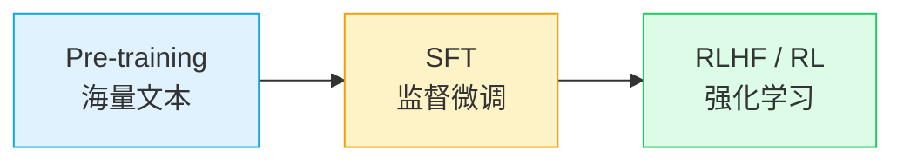

# AI 与游戏开发

从 LLM 到 Agent，从工具到思维方式

  2026

---
layout: section
---

# Part 1: LLM

大语言模型是怎么工作的

---

# Transformer 原理

一切的起点：2017 年 Google 的 "Attention Is All You Need"

<v-clicks>

- **核心思想**：让模型在处理每个词时，能"看到"句子中所有其他词
- **Self-Attention**：为每个词计算与其他词的相关性权重
- **并行计算**：不像 RNN 需要逐步处理，Transformer 可以并行

</v-clicks>

**GPT = Generative Pre-trained Transformer**

- **Generative**：生成式，一个 token 一个 token 往外蹦
- **Pre-trained**：在海量互联网文本上预训练
- **Transformer**：基于 Transformer 架构

---

# 从 GPT 到 GPT-2：Attention 的力量

### 为什么叫"注意力"？

做翻译时的 **视野问题**：

<v-clicks>

- 传统模型只能看前面几个词
- Attention 让模型看到整个句子
- "The animal didn't cross the street because **it** was too tired"
- "it" 指谁？需要看全局上下文

</v-clicks>

### GPT-2 的突破

- 15 亿参数（当时的"大"）
- 零样本学习能力
- OpenAI 一度不敢发布
- 证明了 **Scale 的力量**

如今最强的模型参数量在万亿级别

---

# Token：LLM 的"原子"

为什么 AI 数不对"草莓"里有几个"r"？

<v-clicks>

- LLM 不是按字符处理的，而是按 **Token**
- "strawberry" 可能被切成 "str" + "aw" + "berry"
- 模型从未"看到"过单独的字母

</v-clicks>

### LLM 做的其实是两件事

**1. 计算**

对输入 token 序列做矩阵运算，得到下一个 token 的概率分布

**2. 采样**

从概率分布中选一个 token 输出（temperature 控制随机性）

所以 LLM 本质上是一个超级强大的 **"下一个词预测器"**

---

# Context Window 的限制

LLM 的"工作记忆"是有上限的

### 什么是 Context

<v-clicks>

- 每次对话，模型能看到的 **全部文本**
- 包括系统提示、历史消息、你的问题
- 通常以 token 数衡量（128K、200K...）
- 超出长度 → 旧内容被截断

</v-clicks>

### 实际影响

- **不是"记忆"**：每次请求都从零开始
- **不是越长越好**：注意力在长文本中会衰减
- **很贵**：context 越长，推理成本越高
- 所以 Agent 需要做 **Context 管理**

类比：人的工作记忆大约 7±2 个单元，LLM 的 context 就是它的"工作记忆"

---

# 从 SFT 到 RL

预训练之后，模型还要"上学"

<v-clicks>

- **SFT（Supervised Fine-Tuning）**：用人类标注的问答对微调，让模型学会"对话"
- **RL（Reinforcement Learning）**：用奖励信号优化，让模型在特定任务上变强
- RL 在 **可验证的技术问题** 上进步最快（数学、代码）

</v-clicks>

"很多能力在高度技术性的领域有显著突破。搜索、写作、建议等常见场景并不是进步最大的地方。部分原因是强化学习依赖可验证奖励的技术特性，部分原因是这些场景不被优先投入。"

---

# 不同 AI 的"口癖"

为什么 ChatGPT 和 Claude 说话风格不一样？

<v-clicks>

- **训练数据不同**：预训练语料的分布差异
- **SFT 标注风格不同**：标注员的写作风格会被模型学到
- **RLHF 偏好不同**：什么样的回答会被奖励
- **System Prompt**：每家公司给 AI 的"人设"不同

</v-clicks>

**ChatGPT**

"Sure! Here's..."

偏正式、结构化

**Claude**

"I'd be happy to..."

偏口语、有温度

**DeepSeek**

"好的，让我来..."

更偏中文互联网

---

# 到多模态

图像也可以是 Token

<v-clicks>

- 文本 token → 图像 token → 音频 token → 视频 token
- **核心思路**：只要能编码成 token 序列的数据，都可以用 Transformer 处理
- 图像被切成小块（patch），每个 patch 变成一个 token
- 所以 GPT-4o 能"看图说话"、Sora 能"文字生成视频"

</v-clicks>

**关键洞察**：Transformer 是一个通用的序列建模架构

不在乎你输入的是文字、像素还是音符 —— 只要是 token 序列就行

---
layout: section
---

# Part 2: Agent 时代

从"聊天"到"干活"

---

# 从 Chatbot 到 Agent

### Chatbot

**聊天机器人**

- 你问我答
- 单轮或多轮对话
- 不能操作外部系统
- ChatGPT 早期形态

### Cursor

**代码助手**

- 集成到 IDE
- 能读写文件
- 能运行命令
- 但仍需要人来指挥

### Claude Code

**编程 Agent**

- 自主规划任务
- 自己跑 bash 命令
- 能搜索、编辑、测试
- 人只需要审核结果

**关键区别**：AI 有能力调用工具了

几个 bash 命令 = 可视化能力、文件操作、网络请求、自动化测试...

---

# MCP：给应用以能力

Model Context Protocol — 让 AI 调用外部工具的标准协议

<v-clicks>

- AI Agent 需要和外部世界交互（读文件、查数据库、调 API）
- **MCP** 提供了一个标准化的方式来定义这些"工具"
- 类似于 USB：统一接口，即插即用

</v-clicks>

### Agent 不喜欢 Binary

一个真实案例：UE（Unreal Engine）

- UE 的资产是二进制格式（.uasset）
- AI Agent 无法直接读写二进制
- 需要 MCP Server 把二进制操作封装成文本接口
- **教训**：想让 AI 帮忙，系统需要对 Agent 友好

---

# 从 MCP 到 Skill

工具的进化

### MCP（工具）

<v-clicks>

- 定义能力：读文件、查数据库...
- 一次性加载所有工具定义
- 适合固定的、通用的操作

</v-clicks>

### Skill（技能）

<v-clicks>

- **文件分发**：按需加载相关上下文
- **渐进式披露**：先给概要，需要时再给细节
- 减少 token 消耗，提高任务成功率
- 适合复杂的、需要领域知识的任务

</v-clicks>

从"给 AI 一堆工具"进化到"教 AI 一项技能"

---

# 龙虾：一个完整的 Agent 系统

构建生产级 Agent 需要的核心组件

**Persistent Sessions** — 持久化会话

**SOUL.md** — 赋予 Agent 人格

**Adding Tools** — 扩展工具集

**Permission Controls** — 权限管控

**The Gateway** — 网关路由

**Context Compaction** — 上下文压缩

**Long-Term Memory** — 长期记忆

**Command Queue** — 命令队列

**Cron Jobs (Heartbeats)** — 定时任务

**Multi-Agent** — 多 Agent 协作

---

# Build for Agents

Agent 很强，但需要我们为它们铺路

<v-clicks>

- **Feedback Loop**：让 Agent 能验证自己的输出
  - 跑测试、看编译报错、检查截图...

- **Sandbox**：给 Agent 一个安全的"沙盒"
  - 它可以放心尝试，不怕搞坏生产环境

- **易于 Verify**：让人类容易审核 Agent 的工作
  - 清晰的 diff、可复现的步骤、自动化检查

</v-clicks>

**最重要的原则**：让 Agent 能自己验证自己的输出

---
layout: section
---

# Part 3: 游戏

AI 与游戏开发的三条路

---

# 互动性：AI 在游戏中的三条路

给人的，核心是互动体验

### AIGC + Coding Agent

用 AI 生成资产和代码

- AI 生成美术素材
- AI 编写游戏逻辑
- AI 辅助关卡设计
- **门槛最低**

### UE MCP / Skill

让 AI 操作引擎

- 通过 MCP 控制 UE
- AI 理解游戏世界
- 自动化工作流
- **工程挑战大**

### 纯世界模型

AI 即引擎

- 模型直接输出画面
- 不需要传统渲染管线
- 类似 Sora/Genie
- **最前沿，最不成熟**

---

# QA 吃香，很难取代

为什么 QA 在 AI 时代反而更重要？

<v-clicks>

- **Latency 的例子**：QTE（Quick Time Event）对延迟极其敏感
  - 差 50ms 手感就不对，这是 AI 很难判断的

- **做出来是一方面，细节打磨是另一方面**
  - AI 能跑通流程 ≠ 体验好
  - 很多"感觉"上的问题，很难靠 AI 去验证

- **人的直觉在这里不可替代**
  - "这个动画过渡不流畅"
  - "这个按钮点起来没反馈感"
  - "打击感不够"

</v-clicks>

---

# AI 能做什么？

逻辑和画面分离做得好的地方，AI 能发挥大作用

<v-clicks>

- **杀戮尖塔 CLI**：战斗逻辑完全可以文本化 → AI 可以自动测试平衡性
- **战斗自动化**：如果战斗系统有干净的 API → AI 可以做大量模拟
- **自动化回归测试**：基于文本日志的流程验证

</v-clicks>

### 前提条件

这要求我们的 **逻辑和画面做到良好的分离**

- 游戏逻辑可以脱离渲染运行
- 状态变化有清晰的文本表示
- API 设计对自动化友好

这本身就是好的工程实践 —— AI 只是给了我们额外的动力去做

---
layout: section
---

# Part 4: 思考

人 + AI，各自的优势

---
layout: two-cols
---

# LLM vs. 人

### LLM

<v-clicks>

- 广博的世界知识（互联网知识）
- 短期记忆（Context Window）
- 活在数字世界
- "Summoning a Ghost" — 召唤一个幽灵
- 能力曲线 "Jagged"（参差不齐）

</v-clicks>

::right::

### 人

<v-clicks>

- 持续学习
- 自带长期记忆
- 活在现实世界
- 想象力
- 挖掘需求的能力
- **Typeless** — 不需要打字就能思考

</v-clicks>

---

# Verifier's Law

"If a task is solvable and it's easy to verify, 
then it's going to get solved by AI."

— Jacob Lauritzen, Legora

<v-clicks>

- **可解决 + 易验证 → AI 终将解决**
  - 代码 bug、数学题、棋类游戏...

- **可解决但难验证 → AI 很难解决**
  - "这个设计好看吗？" "这个剧情有没有吸引力？"

- **对 AI 边界能力的认识**
  - 一切可让 Agent 自己快速验证的 trivial 问题终会被解决

</v-clicks>

---

# Build for Agent

让我们的工作对 AI 友好

<v-clicks>

- 清晰的代码结构和 API → AI 更容易理解和修改
- 良好的测试覆盖 → AI 修改后能自我验证
- 文本化的配置和数据 → AI 能直接操作
- 自动化的 CI/CD → Agent 能自己验证和部署

</v-clicks>

### 这不只是"为 AI 做的"

这些本身就是好的工程实践。AI 只是给了我们更强的理由去做正确的事。

---

# 如何建立对 AI 的直觉

<v-clicks>

**1. 用最好的，自己体验**

少看三大顶会论文，多上手试。 实际用最强模型做真实任务，比看 100 篇评测报告有用。

**2. 不 FOMO**

每个月看下最强的模型什么样就行了。 AI 进步很快，但不需要追每一个发布。

**3. 对产品负责的还是我们自己**

AI 是工具，不是决策者。 最终的产品质量、用户体验，责任在我们。

</v-clicks>

---
layout: center
class: text-center
---

# 谢谢

AI 在飞速进步，但游戏是做给人玩的

我们要做的是：理解 AI 的能力边界，用好它，然后专注于人的价值

Q & A

